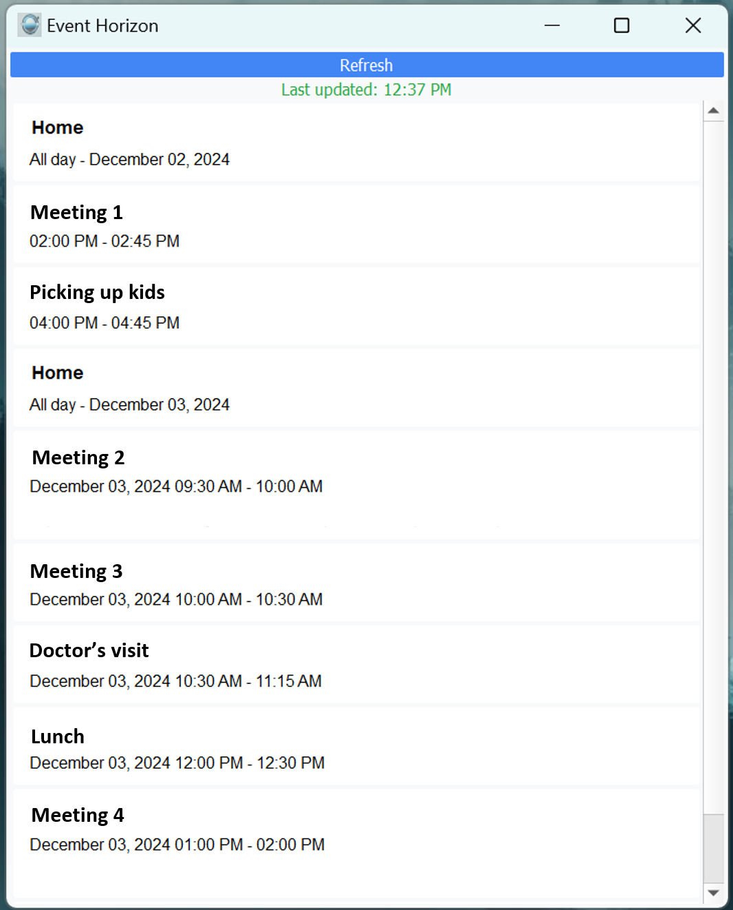

# Event Horizon - Google Calendar Desktop Widget

Stay Ahead, Stay Organized

In a fast-paced world, managing your schedule shouldn't be a hassle. EventHorizon is your minimalist desktop companion, designed to keep your Google Calendar events at your fingertips. No more switching tabs or fumbling through apps—EventHorizon brings your schedule directly to your desktop, always visible, always in sync.

Why Choose EventHorizon?
Always-On Visibility
Never miss an important meeting or deadline. EventHorizon’s resizable and sleek interface ensures your events are always in view.

Real-Time Sync
Stay up-to-date with your Google Calendar. Whether it’s a last-minute change or a new event, EventHorizon keeps you informed in real time.

Minimalist Design
A clean, distraction-free interface fits seamlessly into your desktop environment without getting in your way.

No-Frills Productivity
Built for simplicity and efficiency. EventHorizon focuses on what matters—your events, clearly displayed.

## Features

- Shows next 10 upcoming events
- Real-time event notifications (30 minutes and 3 minutes before events)
- Always-on-top window option
- Automatic refresh every 15 minutes
- Clean, modern interface
- Windows toast notifications with sound

## Demo



## Setup Instructions

### 1. Python Environment Setup

1. Ensure Python 3.7 or higher is installed
2. Clone this repository
3. Install required packages:
   ```bash
   pip install -r requirements.txt
   ```

### 2. Google Calendar API Setup

Follow these steps to obtain your `credentials.json` file:

1. Go to the [Google Cloud Console](https://console.cloud.google.com/)
2. Create a new project or select an existing one:
   - Click on the project dropdown at the top
   - Click "New Project"
   - Enter a name (e.g., "Event Horizon Widget")
   - Click "Create"

3. Enable the Google Calendar API:
   - Select your project
   - Go to the [API Library](https://console.cloud.google.com/apis/library)
   - Search for "Google Calendar API"
   - Click on it and press "Enable"

4. Configure OAuth consent screen:
   - Go to "OAuth consent screen" in the left sidebar
   - Select "External" user type
   - Fill in the application name ("Event Horizon")
   - Add your email as the support email
   - Add your email in "Developer contact information"
   - Click "Save and Continue"
   - Skip adding scopes for now
   - Skip adding test users
   - Click "Back to Dashboard"

5. Create OAuth 2.0 credentials:
   - Go to "Credentials" in the left sidebar
   - Click "Create Credentials" at the top
   - Select "OAuth client ID"
   - Choose "Desktop app" as the application type
   - Name it "Event Horizon Desktop Client"
   - Click "Create"

6. Download the credentials:
   - In the OAuth 2.0 Client IDs list, find your app
   - Click the download icon (⭳) on the right
   - Save the file as `credentials.json` in your project directory

### 3. First Run Setup

1. Place the downloaded `credentials.json` file in the same directory as `main.py`
2. Run the application:
   ```bash
   python main.py
   ```
3. On first run, your default browser will open
4. Sign in with your Google account
5. Click "Allow" to grant calendar access
6. The application will create a `token.pickle` file to store your authorization

## Usage

- The widget shows your next 10 upcoming events
- Events auto-refresh every 15 minutes
- Click "Refresh" to manually update events
- Notifications appear:
  - 30 minutes before each event
  - 3 minutes before each event
- Click notifications to dismiss them

## Security Notes

- The application uses OAuth 2.0 for secure authentication
- Credentials are stored locally in `token.pickle`
- Only read-only calendar access is requested
- No data is sent to any third parties

## Troubleshooting

If you encounter authentication issues:
1. Delete `token.pickle` if it exists
2. Ensure `credentials.json` is in the correct directory
3. Restart the application
4. Go through the OAuth flow again

## Dependencies

- PyQt5 (v5.15.9)
- google-api-python-client (v2.97.0)
- google-auth-httplib2 (v0.1.1)
- google-auth-oauthlib (v1.1.0)

## License

MIT License - Feel free to modify and distribute as needed.
